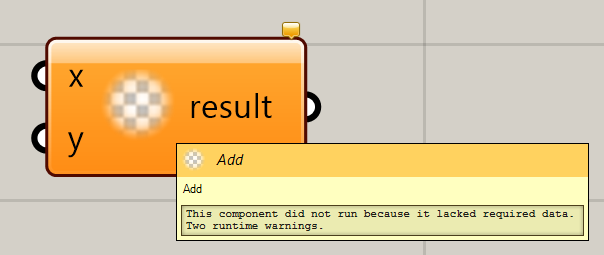

# TedToolkit.Grasshopper

This is designed for simplify your way of developing plugins in Grasshopper.
It is more clean and efficient compared to [SimpleGrasshopper](https://github.com/ArchiDog1998/SimpleGrasshopper).
So almost all features are similar to SimpleGrasshopper.

This tool is using [Roslyn](https://github.com/dotnet/roslyn) to help you coding when you are coding.

## Quick Start

Install the TedToolkit.Grasshopper and then make sure that your LangVersion is `latest`. At the moment, my Visual
Studio is at the version `17.13.4`.

```html
  <PropertyGroup>
    <LangVersion>latest</LangVersion>
  </PropertyGroup>
  <ItemGroup>
    <PackageReference Include="TedToolkit.Grasshopper" Version="0.9.13" PrivateAssets="all" />
  </ItemGroup>
```

## How to use

### Component

All the components are methods. to simplify creating these things, a `static` method is a component!
To let it know which method should be the component, please tag it with `DocObjAttribute`.

```c#
public class Test
{
    [DocObj]
    public static int Add(int x, int y) => x + y;
}
```

Now, you'll see a component in GH!



The parameters can be in, out, or ref

Please notice that, the Source generator will automatically generate the `TedToolkit.Resources.resx` file and the
icons.png located in `Icons` Folder. Here are the structure.

- Icons
    - MyGrasshopperAssembly1.Component_Add.png
    - XXX.png
    - ...
- l10n
    - TedToolkit.Resources.resx

> [!NOTE]
>
> In `TedToolkit.Resources.resx`, you can't modify it! but you can add your own languages to it, so it is how we do
> with l10n.

> [!WARNING]
>
> You can't modify the pngs when your IDE is open, so please turn your IDE off when you want to modify the png.
> And the png is the icons in the grasshopper.

#### General Infos

This is the general infos that almost all items can be used with.

##### Category and Subcategory

You can add the attribute `CategoryAttirbute` and `SubcategoryAttribute` to control them.
Only the `closest` attribute to the `DocObj` will affect.

```c#
[Category("MyCategory")]
public class Test
{
    [Subcategory("SubCate")]
    [DocObj]
    public static int Add(int x, int y) => x + y;
}
```

##### Default Name/NickName/Description

For adding the name or nickname or description on the Document object, you can add the attribute `ObjNamesAttribute`.

```c#
public class Test
{
    [ObjNames("Addition", "Add", "Normal adding")]
    [DocObj]
    [return: ObjNames("Result", "r", "Description of the result.")]
    public static int Add(
        [ObjNames("X", "x", "Description of x")]int 
        x, int y) => x + y;
}
```

##### Exposure

For changing the Exposure, please add the `ExposureAttribute` on it.

```c#
public class Test
{
    [Exposure(GH_Exposure.secondary)]
    [DocObj]
    public static int Add(int x, int y) => x + y;
}
```

##### Category Information

If you want to set the category's Short Name or Symbol name, pelase use the attribute `CategoryInfoAttribute` on the
assembly.

```c#
[assembly: CategoryInfo(null, "Short Name", 'S')]
```

##### Obsolete

Of course, ObsoleteAttribute can be used on.

```c#
public class Test
{
    [Obsolete]
    [DocObj]
    public static int Add(int x, int y) => x + y;
}
```

##### Attributes

You can add your custom attributes on your object by using `ObjAttrAttribute<>`.

```c#
file class MyAttribute(IGH_Component component) 
    : GH_ComponentAttributes(component);

public class Test
{
    [ObjAttr<MyAttribute>]
    [DocObj]
    public static int Add(int x, int y) => x + y;
}
```

##### Guid

You can set the custom ComponentGuid by using the attribute `ObjGuidAttribute`.

```c#
public class Test
{
    [ObjGuid("71156816-F2C5-46B0-B6D9-E71F28CDF7A4")]
    [DocObj]
    public static int Add(int x, int y) => x + y;
}
```

#### Component Infos

For some cases, you may want to add more information for this component.

##### Base Component

If you want to add your own base component, do it with `BaseComponentAttribute<>`.

```c#
file abstract class MyComponent(string name, string nickname, string description, string category, string subCategory) 
    : GH_Component(name, nickname, description, category, subCategory)
{
}

public class Test
{
    [BaseComponent<MyComponent>]
    [DocObj]
    public static int Add(int x, int y) => x + y;
}
```

##### Task Capable Component

If you want to create a Task Capable Component, please make your method return a Task or ValueTask or your custom
awaitable things.

```c#
public class Test
{
    [DocObj]
    public static Task<int> AddAsync(int x, int y) => Task.FromResult(x + y);
}
```

> [!NOTE]
>
> It needs to create
> the [record](https://learn.microsoft.com/en-us/dotnet/csharp/language-reference/builtin-types/record).
> So you may need the package [PolySharp](https://www.nuget.org/packages/PolySharp) or you need to add these codes
> below to your project

```c#
namespace System.Runtime.CompilerServices
{
    internal static class IsExternalInit;
}
```

##### Upgrade Component

If you want to make an `IGH_UpgradeObject` to update your component, add the attribute `UpgradeToAttribute` or
`UpgradeFromAttribute` to
make it.

```c#
public class Test
{
    [UpgradeTo<Component_Add>(2025, 3, 26)]
    [DocObj]
    public static int OldAdd(int x, int y) => x + y;
    
    [DocObj]
    public static int Add(int x, int y) => x + y;
}
```

```c#
public class Test
{
    [UpgradeFrom("498A54B0-DA31-4C9F-905D-6FEA011DBFD5", 2025, 3, 26)]
    [DocObj]
    public static int Add(int x, int y) => x + y;
}
```

#### Parameter Infos

This is for the parameters info, so you can add your own things.

##### Get Component or Data Access

You can get the IGH_DataAccess or IGH_Component just by adding it into your parameters

```c#
public class Test
{
    [DocObj]
    public static int Add(IGH_DataAccess access, IGH_Component component, int x, int y) => x + y;
}
```

##### Parameter Type

You can specify the parameter type by using the attribute `ParamTypeAttribute`.
You can specify the type or the guid. But it is better to do it with type by the generic one.

```c#
public class Test
{
    [DocObj]
    public static int Add([ParamType<Param_Integer>]int x, [ParamType("{2E3AB970-8545-46bb-836C-1C11E5610BCE}")]int y) => x + y;
}
```

##### Persistent Data

For the persistent data, you need to add the attribute `PersistentDataAttribute` on the parameter.

```c#
public class Others
{
    internal static int yDefault = 1;
}

public class Test
{
    internal static int xDefault = 0;
    [DocObj]
    public static int Add(
        [PersistentData(nameof(xDefault))]int x,
        [PersistentData<Others>(nameof(Others.yDefault))] int y)
        => x + y;
}
```

Or you can just make a default value.

```c#
public class Test
{
    [DocObj]
    public static int Add(int x, int y = 10) => x + y;
}
```

##### Optional

Optional the data by the attribute `OptionalAttribute`.

```c#
public class Test
{
    [DocObj]
    public static int Add(int x, [Optional]int y) => x + y;
}
```

##### Hidden

If you wanna your geometry is hidden, just add `HiddenAttribute` on it.

```c#
public class Test
{
    public static int Add([Hidden]Arc arc, int y) => (int)arc.Radius + y;
}
```

##### Data Access

for the Data access, List<> means list access, GH_Structure<> means tree access.
Io is a special type which can get the Index, HasGot and the Value.

```c#
public class Test
{
    [DocObj]
    public static int Add(Io<List<int>> x, int y) => x.Index + y;
}
```

##### Tags

For the case that you want to add the parameter with tags, you can add the attribute `ParamTagAttribute`.

```c#
public class Test
{
    [DocObj]
    public static int Add([ParamTag(ParamTagType.Principal | ParamTagType.Flatten)]int x, int y)=> x + y;
}
```

##### Field

For the case you want the parameter is a field in the component, you can use the attribute `ObjFieldAttribute`.
You can also change the config about should it `saveToFile`.

```c#
public class Test
{
    [DocObj]
    public static int Add([ObjField(true)]int x, int y)=> x + y;
}
```

### Parameter

You can also add `DocObjAttribute` on the type to create a new parameter.

```c#
[DocObj]
public class MyType;
```

#### Base Goo

You can specify the Goo type by using `BaseGooAttribute`.
Just notice that don't forget to using `partial` key word to implement your type.

```c#
[BaseGoo<GH_GeometricGoo<MyType>>]
[DocObj]
public class MyType;

partial class Param_MyType
{
    partial class Goo
    {
        public override IGH_GeometricGoo DuplicateGeometry()
        {
            throw new NotImplementedException();
        }

        public override BoundingBox GetBoundingBox(Transform xform)
        {
            throw new NotImplementedException();
        }

        public override IGH_GeometricGoo Transform(Transform xform)
        {
            throw new NotImplementedException();
        }

        public override IGH_GeometricGoo Morph(SpaceMorph xmorph)
        {
            throw new NotImplementedException();
        }

        public override BoundingBox Boundingbox => default;
    }
}
```

#### Type Name & Description

To Add your own type name and type description, you can add the attribute `TypeDescAttribute`.

```c#
[TypeDesc("Type Name", "Type Description")]
[DocObj]
public class MyType;
```

#### Global Type

For the case you want to generate the parameters from other libraries, you can use the attribute `DocObj` on the
assembly to do this.

```c#
[assembly: DocObj<RemoteType>]

public class RemoteType;
```

#### IGH_PreviewData & IGH_BakeAwareData

If you want your param can be previewed or can be baked, just let your class or struct implement the interface
`IGH_PreviewData` or `IGH_BakeAwareData`.

```c#
[DocObj]
public class MyType : IGH_PreviewData, IGH_BakeAwareData
{
    public void DrawViewportWires(GH_PreviewWireArgs args)
    {
    }

    public void DrawViewportMeshes(GH_PreviewMeshArgs args)
    {
    }

    public BoundingBox ClippingBox => BoundingBox.Unset;
    public bool BakeGeometry(RhinoDoc doc, ObjectAttributes att, out Guid obj_guid)
    {
        obj_guid = Guid.Empty;
        return false;
    }
}
```

### Others

#### Localization

For the case you want to use the TedToolkit.Resources. You can do this to let it generate the string for you.

```c#
"Localization String".Loc("Optional Key");
```